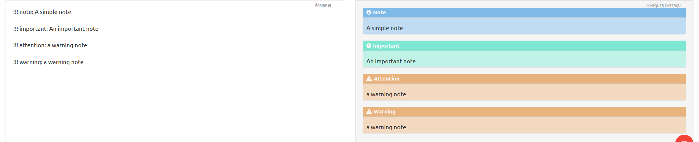

# nodebb-plugin-extended-markdown
A NodeBB plugin to extend markdown with new feature as tooltip, anchor, custom text header with background, color, code block with multiple languages and text align.

## Installation
`npm install nodebb-plugin-extended-markdown`

## Use

### Color
A color picker is available in the composer:


The syntaxe is:
`%(#hexColorCode)[colored text]`

### Text align
You can align right by adding `-|` at the end of your paragraph. Likewise, you can align left a text by adding `|-` at the begin of your paragraph.
Combining the two will center the text.


You can also justify your paragraph by adding `|=` at the begin and `=|` at the end.

/!\ Warning, text align is applied on the whole paragraph, so this will not work:
``` 
|-This text won't be centered because the ending tag is at the end of the line instead of the end of the paragraph.-|
This is still the same paragraph! You need to add two new lines to start a new paragraph
```

### Tooltip
Tooltip allow you to add an overtext on another text. The syntax is `°text°(tooltip text)`. You can use `fa-info` as text, in this case it will show the fa-info icon:


### Anchor
All heading (h1, h2, etc., `#` in markdown) will automatically have an anchor of the same name except that the spaces will be replaced by dashes and all non alphanumeric chars will be remove.
You can then create a link to this anchor with the usual markdown syntax: `[link name](#anchor-name)`

### Text heading with background
Specially added for Minecraft Forge France's tutorials, this one is a h2 with a background. You can add it with `#anchor-name(title)` where anchor-name is the name of the anchor. You can then create a link to this anchor with the usual markdown syntax: `[link name](#anchor-name)`


Currently the plugin haven't any option to change the color, but you can still override the css by adding:
```css
.text-header {
    background-color: anotherColor;
}
```
in you nodebb custom css (admin/appearance/customise).

### Grouped code
Also added for the needs of our tutorials, it allow to show multiples languages with nice tabs. The syntaxe is a bit complex:
```
===group
\```python
print("Hello world!")
\```
\```javascript
console.log("Hello world!")
\```
===
```
And the result:


You can add more than two languages.

### Note

Enable to emphasise some element with a nice design 
```
!!! note: A simple note

!!! important: An important note

!!! warning: A warning note
Can be in multiple line !
```

And the result;



You can change the colors by override the css:
```css
.admonition.important { 
    background: #c0f2e8;
}
.admonition.important .admonition-title {
    background: #7de8d2;
}
.admonition.note { 
    background: #c0dcf2;
}
.admonition.note .admonition-title { 
    background: #7dbae8;
}
.admonition.attention, .admonition.warning { 
    background:#f2d9c0;
}
.admonition.attention .admonition-title, .admonition.warning .admonition-title {
    background:#e8b37d;
}
```
in you nodebb custom css (admin/appearance/customise).
